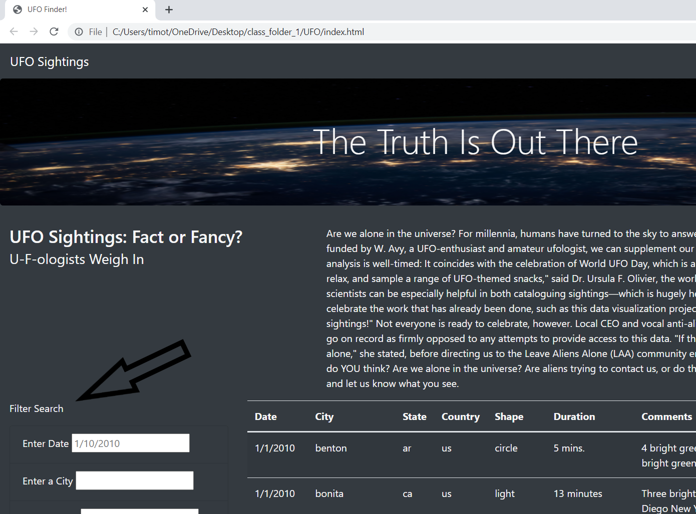
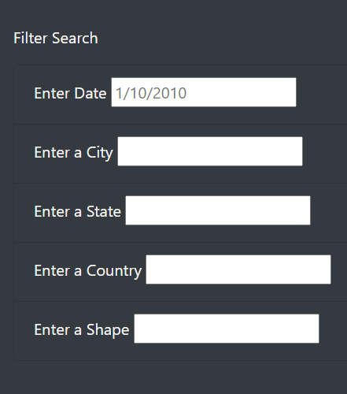
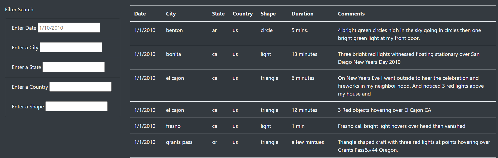
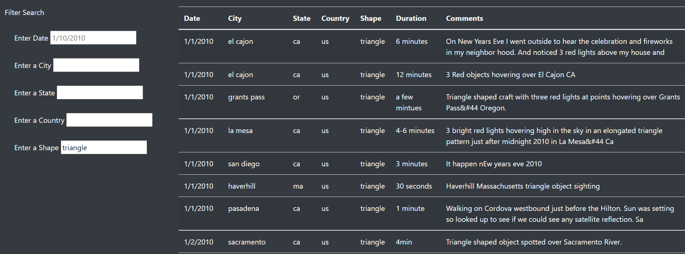
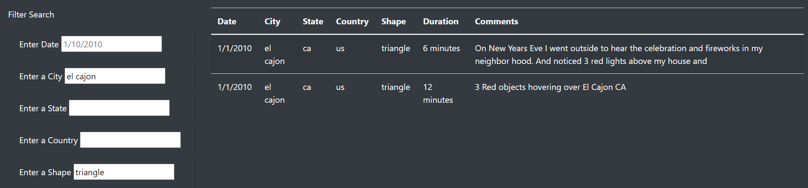

# UFO

## Overview of the Project
The purpose of this project is to provide a platform from where an interested party can perform analysis on data related to UFO sightings.  We provide the ability to perform more in-depth analysis of UFO sightings by allowing users to filter for multiple criteria at the same time - table filters for the date, city, state, country, and shape of the UFO.

## Results
Our website hosts a large amount of data concerning UFO sightings.  We have provided a Search functionality to allow users to easily search, and it is located on the left side of the display, as seen here:

The search filters are: Date, City, State, Country & Shape.  Dates may be entered in the (M)M-DD-YYYY format; Shape refers to the shape of the UFO that was sighted.  Here are the filters:

By default, none of the filters are acting upon the dataset (even though there is a greyed-out date in the Date filter), and the full dataset is manifest upon a User's first visit to the site, like so:

In order to visualize the functionality of the filters, let us consider a UFO Shape of 'triangle' only.  a User would enter 'triangle' into the Shape filter to see only data about triangle-shaped UFOs, like this:

Users may also enter multiple criteria.  Let's drill down on just one city where there were multiple sightings of triangle-shaped UFOs, 'El Cajon' - a city in California, like this:

## Summary
One drawback of this design is that the data lives on the webpage, only, and cannot be exported.
One idea for future development would be to introduce an export function, so that a User could take away the results of the Search that was performed on our dataset.  A second idea for future development would be to introduce a linking function, so that a User could click on a link, which would navigate their web browser to a news article or other information about the UFO sighting that they are interested in.

